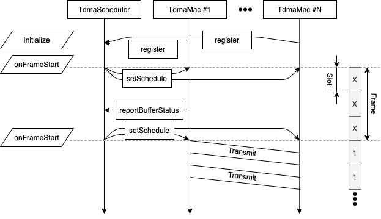

[](https://zenodo.org/badge/latestdoi/397504015)

# omnet-tdma
OMNeT++ TDMA is a simple and abstract implementation of a TDMA MAC protocol. It divides time into time slots which are then groups into frames. For every frame a schedule is created which dictates nodes when to send. In this model, only the transmission of *data* is modelled. Control information is exchanged out of band yielding a strongly idealized model. 

To realize communication,a network interface card (`TdmaInterface`) is implemented to be used in any hosts, as well as an oracle scheduler module (`TdmaScheduler`) which must exist once per simulation. It's operation is depicted below:



First, all `TdmaMac` layers, which are included in the `TdmaInterface`, register themselves to the `TdmaScheduler`. With that, the scheduler is able to create and distribute a new schedule when ever a frame begins. To be included into a schedule, nodes report their buffer status (That is how many packets are queued to be sent) to the scheduler. As depicted above, communication of control information is modelled in an idealized way where it always succeeds and has zero delay.

## Getting Started
To use omnet-tdma, you need to have OMNeT++ 5.6.x installed.
- Clone this repo by `git clone --recursive git@github.com:ComNetsHH/omnet-tdma.git`. This will automatically also download INET v4.2.5 which is the latest supported version for omnet-tdma
- Create a new OMNeT++ workspace in the `omnet-tdma` directory.
- Import `inet` as existing project into the OMNeT++ ide.
- Import `tdma` as existing project into the OMNeT++ ide.
- Make sure `inet` is set as a reference project of `tdma`.
- Navigate to `tdma/simulations/omnetpp.ini` in the OMNeT++ ide and click run. This will trigger the build of `inet` as well as `tdma` and start an example simulation.


More docs available at https://tdma.omnetlense.com/
If you have questions or encounter any issues, reach out to k.fuger@tuhh.de

## Usage 
There are 4 parameters to tune the behavior of the protocol:
- `slotDuration`: The duration of a timesplot in ms (Used in `TdmaMac` and `TdmaScheduler`)
- `frameLength`: The number of timesplots per frame (Used in `TdmaMac` and `TdmaScheduler`)
- `numRetries`: How often a transmission is retried before abandoning the packet (Used in `TdmaMac`)
- `monitorSchedule`: A switch to record the entire schedule during simulation (Used in `TdmaScheduler`)

When the simulation ends, the scheduler collects a utilization statistic denoting how many of the time slots were used.
It also prints the schedule periodically during simulation, which looks like this:
```
TdmaScheduler: End scheduling:
    Slot    |   nodeId
------------+--------------
       0    |   1
       1    |   2
       2    |   3
       3    |   4
       4    |   5
       5    |   6
       6    |   7
       7    |   8
       8    |   9
       9    |   1
```

